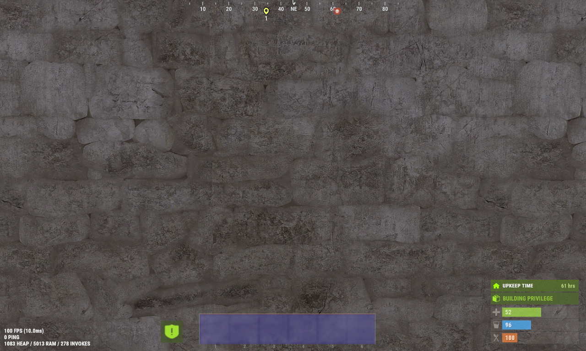
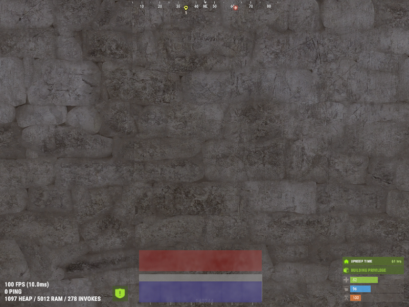
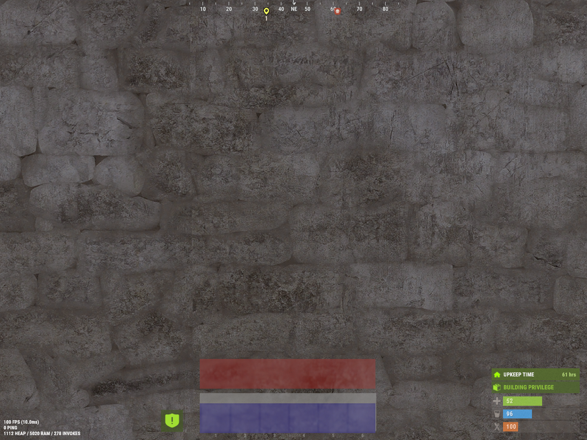
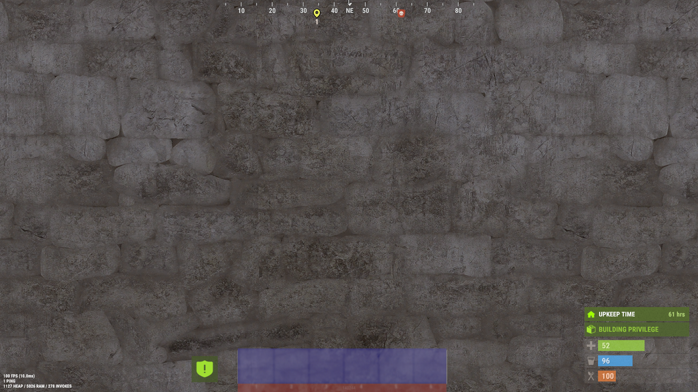

# Example CUI position vs resolution {#CuiPosition-code}

This small example is to show the effect of screen resolution vs. the usage of anchormin/max and offsetmin/max positioning.
The rectangles are all positioned centered on the screen using a 1280x768 resolution. 
note: offsetmin and offsetmax are calculated relative to a 1280x768 resolution.

```csharp
private void TestUi(BasePlayer player)
{
	CuiElementContainer elements = new CuiElementContainer();

	elements.Add(new CuiElement
	{
		Name = "UI_Rectangle1",
		Parent = "Overall",
		Components = {
		new CuiImageComponent {
		  Sprite = "Assets/Content/UI/UI.Background.Tile.psd",
		  Material = "assets/content/ui/uibackgroundblur-ingamemenu.mat",
		  Color = "0.7 0.7 0.7 0.3",
		},
		new CuiRectTransformComponent {
			AnchorMin = "0.34 0.02", AnchorMax = "0.64 0.105" ,
		},
	}
	});

	elements.Add(new CuiElement
	{
		Name = "UI_Rectangle2",
		Parent = "Overall",
		Components = {
		new CuiImageComponent {
		  Sprite = "Assets/Content/UI/UI.Background.Tile.psd",
		  Material = "assets/content/ui/uibackgroundblur-ingamemenu.mat",
		  Color = "0.7 0.1 0.1 0.3",
		},
		new CuiRectTransformComponent {
			AnchorMin = "0.5 0.5", AnchorMax = "0.5 0.5",
			OffsetMin = "-204 -368", OffsetMax= "179 -303",
		},
	}
	});

	elements.Add(new CuiElement
	{
		Name = "UI_Rectangle3",
		Parent = "Overall",
		Components = {
		new CuiImageComponent {
		  Sprite = "Assets/Content/UI/UI.Background.Tile.psd",
		  Material = "assets/content/ui/uibackgroundblur-ingamemenu.mat",
		  Color = "0.1 0.7 0.1 0.3",
		},
		new CuiRectTransformComponent {
			AnchorMin = "0 0", AnchorMax = "0 0",
			OffsetMin = "435 15", OffsetMax= "80 450",
		},
	}
	});

	elements.Add(new CuiElement
	{
		Name = "UI_Rectangle4",
		Parent = "Overall",
		Components = {
		new CuiImageComponent {
		  Sprite = "Assets/Content/UI/UI.Background.Tile.psd",
		  Material = "assets/content/ui/uibackgroundblur-ingamemenu.mat",
		  Color = "0.1 0.1 0.7 0.3",
		},
		new CuiRectTransformComponent {
			AnchorMin = "0.5 0", AnchorMax = "0.5 0",
			OffsetMin = "-204 15", OffsetMax= "179 80",
		},
	}
	});

	CuiHelper.AddUi(player, elements);
}
```
<br>
The images below are all using the positions from the code above and show four rectangles at the center of the screen, at resolution 1280x768. Only the screen resolution change between images.
In this example, the blue layer stay over the player hotbar with different resolution, using AnchorMin = "0.5 0", AnchorMax = "0.5 0". 
<br>
<figure style="text-align: center;">
  
  <figcaption>CUI positioning at 1280x768 resolution.</figcaption>
</figure>
<br>

<figure style="text-align: center;">
  
  <figcaption>CUI positioning at 800x600 resolution.</figcaption>
</figure>
<br>
<figure style="text-align: center;">
  
  <figcaption>CUI positioning at 1440x1080 resolution.</figcaption>
</figure>
<br>
<figure style="text-align: center;">
  
  <figcaption>CUI positioning at 1920x1080 resolution.</figcaption>
</figure>
<br>
<figure style="text-align: center;">
  
  <figcaption>CUI positioning at 2160x1200 resolution.</figcaption>
</figure>
<br>
<figure style="text-align: center;">
  
  <figcaption>CUI positioning at 2560x1440 resolution.</figcaption>
</figure>
<br>
